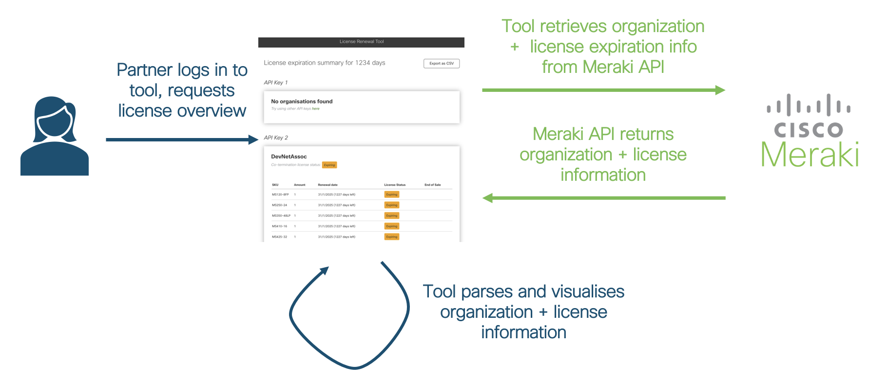
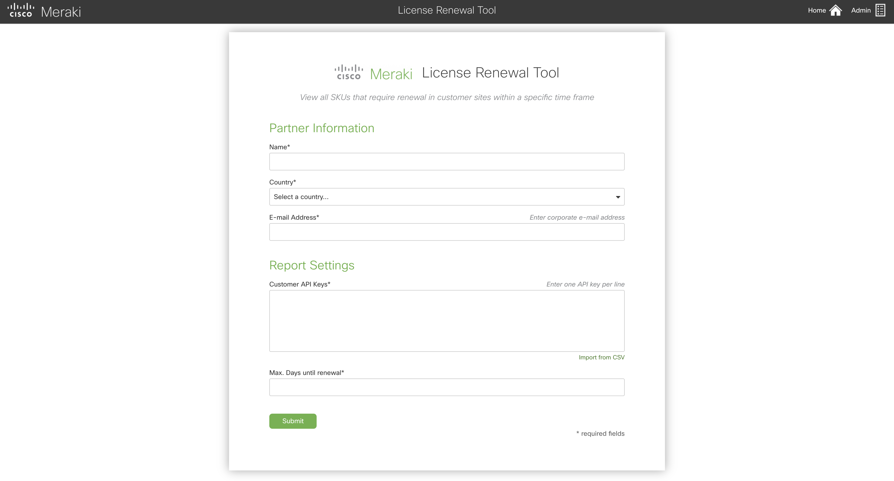
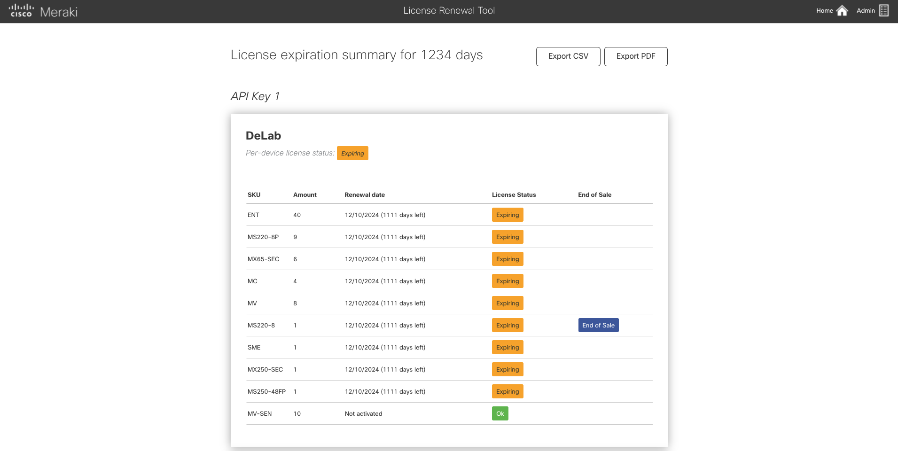
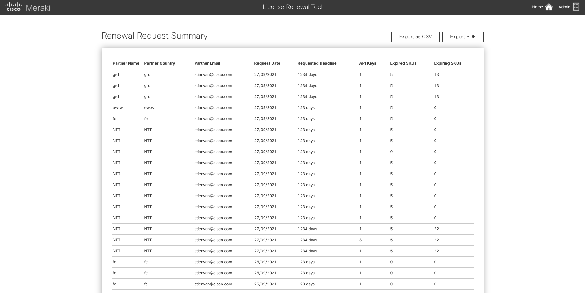

# GVE_DevNet_Meraki_License_Renewal
This repository holds a web application for consulting Meraki license expiration dates. It allows for Cisco partners to get an overview of the Meraki products and corresponding licenses currently in use at all Meraki organizations at their customers, as well as their expiration dates, the time left until expiration, and end of sale/support information. In contrast, the Meraki dashboard only shows this information per Meraki organization. Cisco partners can log into the tool using their name, country, corporate e-mail, and Meraki API keys they are permitted to use. To ease the interaction, partners can moreover specify a *deadline* - licenses expiring within that deadline will be displayed as "Expiring". For tool administrators, the tool provides a log of all requests it previously processed, including the partner information, deadline, and number of expired/expiring licenses.

## High Level PoV Overview



## Contacts
* Stien Vanderhallen (stienvan@cisco.com)
* Ramona Renner (ramrenne@cisco.com)

## Solution Components
* Meraki REST API
* Python
* Django
* PostgreSQL 

## Configuring the application

### 1. Configure tool administrator login
- Open `merakirenewal/webapp/users.json` in a text editor

- Change/add/remove objects of email/username/password information as desired. This information will be loaded into the tool's database on startup.

- When accessing the *Admin* information in the tool, these accounts will be valid.

### 2. Configure corporate e-mail suffixes
- Open `merakirenewal/webapp/email_whitelist.json` in a text editor

- Change/add/remove strings for allowed e-mail prefixes as desired. This information will be loaded into the tool's database on startup.

- When logging on to the tool, partner e-mailaddresses will be checked against this whitelist, i.e., e-mail addresses that do not end in a suffix listed in `merakirenewal/webapp/email_whitelist.json` will not be able to retrieve license information.

### 3. Configure end-of-sale/end-of-support information
- Open `merakirenewal/webapp/endofsale.json` in a text editor

- Change/add/remove objects of SKU/end-of-sale/end-of-support information according to the most recent information. The repository's information is based on [this page as consulted on 17/09/2021](https://documentation.meraki.com/General_Administration/Other_Topics/Product_End-of-Life_(EOL)_Policies).

- End-of-sale/end-of-support information will be displayed by the tool based on this file. 

## Starting the application

### 1. Clone repository

```
$ git clone https://github.com/Radmanded/gve_devnet_meraki_license_renewal.git
$ cd gve_devnet_meraki_license_renewal
```

### 2. Build local Django application:

*NOTE: Assure lines 93-96 are **NOT** commented in `gve_devnet_meraki_license_renewal/merakirenewal/merakirenewal/settings.py`*

```
$ pip install -r requirements.txt
$ cd merakirenewal
$ python manage.py runserver
```

### 3. In a browser, navigate to `localhost:8000`

# Screenshots

- Login page


- License information overview


- For tool administrators: log overview


### Using the License Renewal Tool

- Enter you name and country

- Enter **j@cisco.com** in the E-mail Address* 

- Enter API keys manually or import from CSV

- Enter the number of days 

### Troubleshooting


### LICENSE

Provided under Cisco Sample Code License, for details see [LICENSE](LICENSE.md)

### CODE_OF_CONDUCT

Our code of conduct is available [here](CODE_OF_CONDUCT.md)

### CONTRIBUTING

See our contributing guidelines [here](CONTRIBUTING.md)

#### DISCLAIMER:
<b>Please note:</b> This script is meant for demo purposes only. All tools/ scripts in this repo are released for use "AS IS" without any warranties of any kind, including, but not limited to their installation, use, or performance. Any use of these scripts and tools is at your own risk. There is no guarantee that they have been through thorough testing in a comparable environment and we are not responsible for any damage or data loss incurred with their use.
You are responsible for reviewing and testing any scripts you run thoroughly before use in any non-testing environment.
